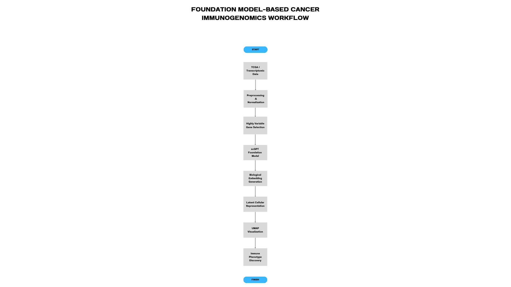

# Foundation Models for Cancer Immunogenomics

## Overview

This project explores transformer-based biological representation learning using scGPT foundation models for immune phenotype characterisation in transcriptomic cancer datasets.

The workflow demonstrates how pretrained biological transformers can generate latent cellular embeddings for downstream immunogenomics analysis and precision medicine research.

---

## Research Objectives

- Learn biological representations using transformer foundation models
- Analyse immune-related transcriptomic phenotypes
- Explore latent cellular embedding spaces
- Perform representation learning for cancer immunology
- Investigate zero-shot biological transfer learning

## Project Workflow



---
## OR

TCGA/GTEx RNA-seq
        ↓
Preprocessing
        ↓
RNA Foundation Model
        ↓
Embedding Generation
        ↓
Clustering
        ↓
UMAP Visualisation
        ↓
Immune Phenotype Discovery

---
## Technologies Used

- Python
- Scanpy
- scGPT
- PyTorch
- Single-cell RNA-seq
- TCGA
- UMAP
- Transformer Models
- Computational Immunogenomics

---

## Repository Structure

```text
Foundation-Models-for-Cancer-Immunogenomics/
│
├── notebooks/
│   ├── scGPT_Biological_Representation_Learning.ipynb
│   └── TCGA_Immune_Phenotype_Analysis.ipynb
│
└── README.md
```

---

## Workflow

1. Load transcriptomic datasets
2. Perform preprocessing and normalisation
3. Select highly variable genes
4. Generate biological embeddings using scGPT
5. Construct latent cellular representations
6. Visualise embeddings using UMAP
7. Analyse immune-related phenotypes
8. Explore representation learning in cancer biology

---

## Biological Significance

This project demonstrates how transformer-based foundation models can capture biologically meaningful transcriptomic patterns and transfer learned representations across datasets.

The workflow supports emerging applications in:

- Cancer Immunology
- Precision Oncology
- Single-Cell AI
- Computational Biology
- Biomedical Foundation Models

---

## Key Concepts

- Biological Representation Learning
- Foundation Models for Biology
- Transformer-Based Transcriptomics
- Latent Cellular Embeddings
- Zero-Shot Biological Inference
- Computational Immunogenomics

---

## Future Improvements

- Multi-omics integration
- Spatial transcriptomics analysis
- Survival prediction modeling
- Cell-cell interaction analysis
- Foundation model benchmarking
- Clinical response prediction

---

## Workflow


## Results

### UMAP Visualization


### Cluster Distribution


### Top Gene Drivers


## Author

Heena Afreen

Bioinformatics | Computational Biology | AI in Genomics | Cancer Immunogenomics

git add .
git commit -m "Added transcriptomic embedding visualizations"
git push
