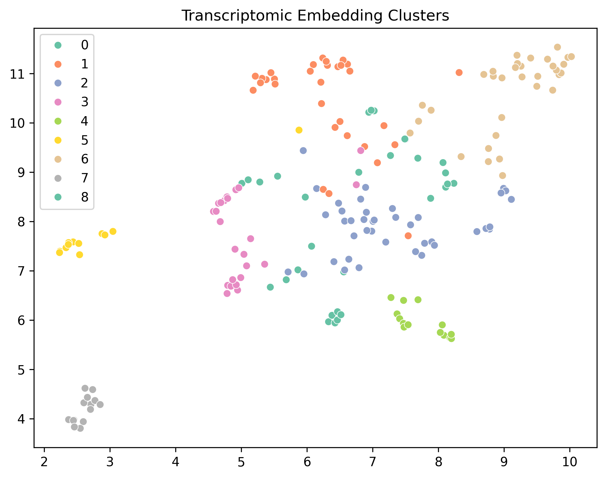
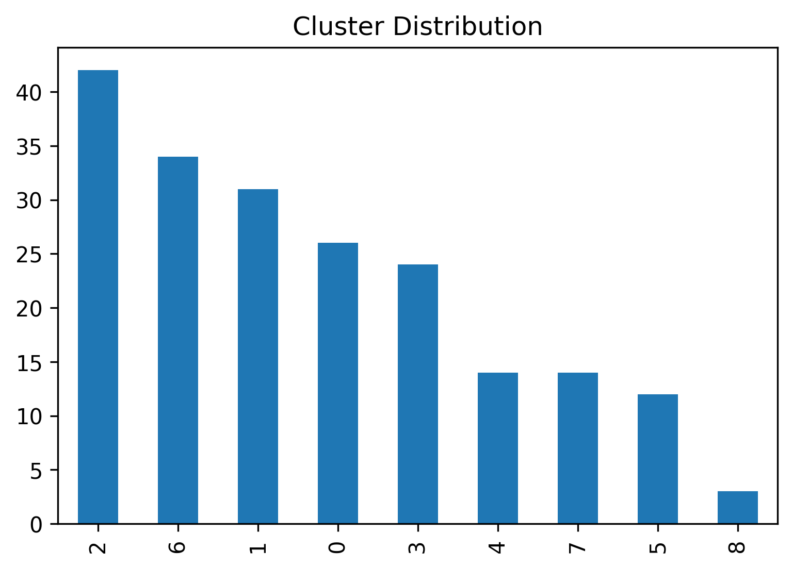
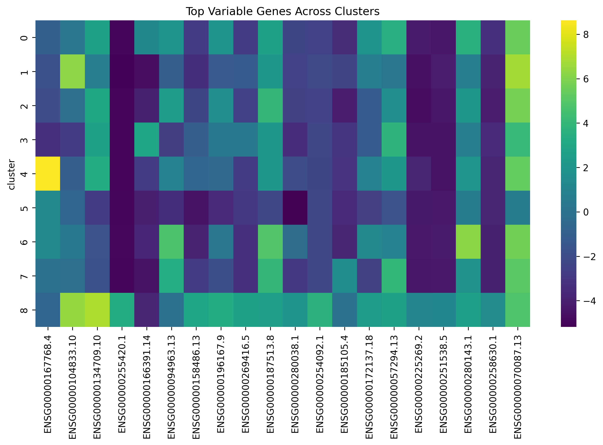

# Foundation Model-Based Discovery of Immune Phenotypes in Cancer Transcriptomes

## Overview

This repository demonstrates a transcriptomic representation learning workflow for discovering latent immune-related phenotypes from cancer and normal tissue RNA-seq data.

The project explores how transcriptomic embeddings generated from gene expression profiles can be used for unsupervised biological pattern discovery, cluster identification, and visualisation of transcriptomic heterogeneity.

## Research Question

Can transcriptomic embeddings identify latent immune-related phenotypes in cancer transcriptomes?

## Hypothesis

Gene expression profiles contain biologically meaningful latent structures that can be captured through representation learning and used to reveal distinct transcriptomic phenotypes.

---

## Objectives

* Generate transcriptomic embeddings from RNA-seq data
* Identify latent biological clusters
* Visualize transcriptomic structure
* Characterize immune-related heterogeneity
* Explore representation learning approaches for cancer immunogenomics

---

## Dataset

* TCGA RNA-seq samples
* GTEx RNA-seq samples
* Demonstration transcriptomic dataset containing 200 samples and 100 genes

---

## Workflow

RNA-seq Data

↓

Preprocessing

↓

Missing Value Imputation

↓

PCA Embedding Generation

↓

KMeans Clustering

↓

UMAP Visualisation

↓

Cluster Characterization

↓

Immune Phenotype Discovery

---

## Technologies Used

* Python
* Pandas
* NumPy
* Scikit-learn
* UMAP
* Seaborn
* Matplotlib

---

## Repository Structure

Foundation-Models-for-Cancer-Immunogenomics/

├── notebooks/

│   └── TCGA_Immune_Phenotype_Analysis.ipynb

│

├── images/

│   ├── workflow.png

│   ├── UMAP_Transcriptomic_Clusters.png

│   ├── Cluster_Distribution.png

│   └── Top_Genes_Heatmap.png

│

└── README.md

---

## Results

### Optimal Cluster Number

Silhouette analysis identified:

* Best K = 9
* Silhouette Score = 0.171

### Transcriptomic Clusters

Nine latent transcriptomic clusters were identified from transcriptomic embeddings.

### UMAP Visualization

UMAP revealed clear separation between multiple transcriptomic phenotypes, indicating that biologically meaningful structure exists within the expression space.

### Cluster Distribution

Cluster sizes varied across the dataset, suggesting heterogeneous transcriptomic populations.

### Gene Driver Analysis

Cluster-specific gene expression patterns were observed, indicating potential biological and immune-related heterogeneity among samples.

---

## Biological Significance

This project demonstrates how transcriptomic representation learning can uncover latent biological structure in RNA-seq data.

Potential applications include:

* Cancer Immunology
* Computational Biology
* Precision Oncology
* Transcriptomic Phenotyping
* Biomarker Discovery
* Representation Learning for Biomedical Data

---

## Future Improvements

### Version 2 Roadmap

RNA-seq

↓

scGPT Foundation Model

↓

Biological Embeddings

↓

UMAP

↓

Clustering

↓

Immune Phenotype Discovery

Planned extensions:

* scGPT-based embedding generation
* Foundation model benchmarking
* Multi-omics integration
* Immune cell-state annotation
* Survival analysis
* Clinical outcome prediction
* Transfer learning across transcriptomic datasets

---

## Author

Heena Afreen

Bioinformatics | Computational Biology | AI in Genomics | Cancer Immunogenomics
